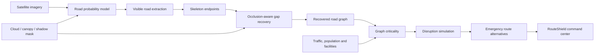

# RouteShield — Route Resilience AI

An end-to-end geospatial AI platform for extracting urban roads under cloud, canopy and shadow occlusion, repairing broken topology, ranking network-critical links and simulating mobility disruptions with explainable alternate routes.

Built for Problem Statement 4 of the **Bharatiya Antariksh Hackathon 2026**:

> **Route Resilience: Occlusion-Robust Road Extraction & Graph-Theoretic Criticality Analysis for Urban Mobility**

## What is implemented

- Interactive Next.js urban mobility command center
- Deterministic 48-node, 91-link demonstration city
- Satellite-like scene renderer with cloud, tree-canopy and building-shadow masks
- Interpretable road-probability and morphology baseline
- Trainable histogram-gradient-boosting pixel classifier
- Skeleton endpoint detection and graph-aware occlusion gap recovery
- Weighted road graph with traffic, speed, road class, flood risk and population exposure
- Edge betweenness, detour impact, isolation impact, bridge and redundancy analysis
- Relative 0–100 criticality ranking for every road link
- Flood, bridge, construction and critical-link disruption scenarios
- Reachability, isolated population, detour and network-efficiency outputs
- Emergency route alternatives after road failures
- FastAPI service with typed contracts and OpenAPI explorer
- Python and frontend-engine tests
- Docker Compose deployment and GitHub Actions quality gates
- Architecture, methodology, data, API and model-card documentation

## Product workflow



## Application workspaces

| Workspace | Capability |
| --- | --- |
| Extraction view | Shows observed road links and explicit cloud/canopy/shadow masks |
| Recovery view | Highlights road links that intersect occlusions and repaired topology |
| Criticality view | Ranks links by graph importance, detour, isolation and redundancy |
| Disruption view | Visualizes failed links and the resilient emergency route |
| Link intelligence | Explains why a selected road segment matters |
| Scenario lab | Runs critical-link, flood, bridge and construction stress tests |
| Emergency routing | Compares baseline and post-disruption routes |

## Quick start

### Docker

```bash
cp .env.example .env
docker compose up --build
```

Open:

- Web application: `http://localhost:3000`
- API explorer: `http://localhost:8000/docs`

### Local development

```bash
python -m venv .venv
source .venv/bin/activate
python -m pip install -e ".[dev]"
npm install
```

Run the API:

```bash
make api
```

Run the web application in another terminal:

```bash
make web
```

## API examples

Analyze road extraction and topology recovery:

```bash
curl -X POST http://localhost:8000/v1/extraction/analyze \
  -H "Content-Type: application/json" \
  -d '{"seed":2026}'
```

Simulate a flood corridor:

```bash
curl -X POST http://localhost:8000/v1/scenarios/simulate \
  -H "Content-Type: application/json" \
  -d '{"kind":"flood_corridor","severity":0.7,"origin":"N0000","destination":"N0507"}'
```

Request route alternatives while excluding failed links:

```bash
curl -X POST http://localhost:8000/v1/routes/alternatives \
  -H "Content-Type: application/json" \
  -d '{"origin":"N0000","destination":"N0507","excluded_edges":["E014"],"alternatives":3}'
```

## Road extraction strategy

The default offline baseline combines brightness, spectral neutrality, texture and morphology. Known occlusions are excluded from direct extraction. The resulting road skeleton is inspected for endpoints; candidate endpoint pairs are scored using distance, directional continuity and the proportion of their connecting line inside an occlusion mask. Only links joining different visible components are accepted, and newly inferred pixels remain restricted to the masked area.

The repository also includes a trainable pixel classifier. Its synthetic holdout metrics are approximately:

| Metric | Value |
| --- | ---: |
| Precision | 0.996 |
| Recall | 0.995 |
| F1 | 0.995 |
| IoU | 0.991 |

These figures validate the generated-data pipeline and software implementation. They are **not field-performance claims**.

## Criticality model

Each link is scored using:

- weighted edge betweenness;
- shortest-path detour after removal;
- isolated population;
- unreachable critical origin-destination pairs;
- baseline traffic flow;
- flood exposure;
- road-extraction uncertainty;
- bridge status and alternate-route redundancy.

Scores are normalized within the active network snapshot. A score of 90 means that a link is among the highest priorities in that scene; it does not represent a universal engineering risk threshold.

## Reproducible demonstration data

```bash
make demo
```

This writes `data/generated/demo_city.json`. The fixed seed creates 48 nodes, 91 links, five critical facilities and four occlusion regions. It does **not** represent current observed road or traffic conditions in Delhi.

Train the bundled pixel baseline:

```bash
make train
```

## Validation

```bash
make test
```

Validated locally:

- 13 Python tests covering data generation, extraction, gap recovery, graph analysis, scenarios and API contracts
- 4 Node tests covering deterministic network generation, shortest paths, criticality and disruption simulation
- Python bytecode compilation
- deterministic data generation

Full quality workflow:

```bash
make quality
```

## Repository structure

```text
apps/web/                 Next.js mobility resilience command center
services/api/             FastAPI service and HTTP contracts
ml/route_resilience/      Extraction, recovery, graph and scenario engine
scripts/                  Demo-data and training entrypoints
tests/                    Python model, graph, scenario and API tests
docs/                     Architecture, methodology, data, API and model card
data/samples/             Demonstration-data guidance
.github/workflows/        Automated quality checks
```

## Production extension path

1. Replace generated imagery with orthorectified, quality-controlled satellite scenes.
2. Add authoritative cloud, shadow and land-cover masks.
3. Train a topology-aware segmentation model on geographically separated areas.
4. Convert recovered centerlines into a validated routable network.
5. Integrate time-dependent traffic, closures, hazard forecasts and facility demand.
6. Calibrate criticality weights with transport authorities and emergency services.
7. Add uncertainty review and human approval for inferred road links.

## Responsible use

RouteShield is a planning and research prototype. Recovered links are hypotheses, not authoritative roads. Disruption results are modeled comparisons, not operational guarantees. Safety-critical routing requires verified maps, current closure feeds, traffic validation, hazard-specific engineering review and responsible human oversight.

## License

MIT
