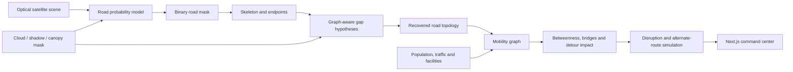

# System architecture

RouteShield separates perception, topology recovery, graph analytics, disruption simulation and presentation so each layer can be validated independently.

## Components

- **`ml/route_resilience/demo.py`** — reproducible road network and satellite-scene generator.
- **`extraction.py`** — spectral/texture baseline, morphology, skeleton endpoints and occlusion-aware gap completion.
- **`training.py`** — trainable histogram-gradient-boosting pixel classifier benchmark.
- **`criticality.py`** — weighted mobility graph, edge betweenness, removal detour, isolation impact and redundancy.
- **`scenarios.py`** — flood, bridge, construction and critical-link failure scenarios with emergency route alternatives.
- **FastAPI** — typed endpoints for city analysis, extraction, routing and disruptions.
- **Next.js** — offline-capable demonstration workspace with a deterministic client engine.

## Deployment boundary

The bundled UI can demonstrate all controls without a live API. Production deployments should retrieve immutable observed-data snapshots through the API and keep model version, graph version and scenario assumptions with every exported assessment.
